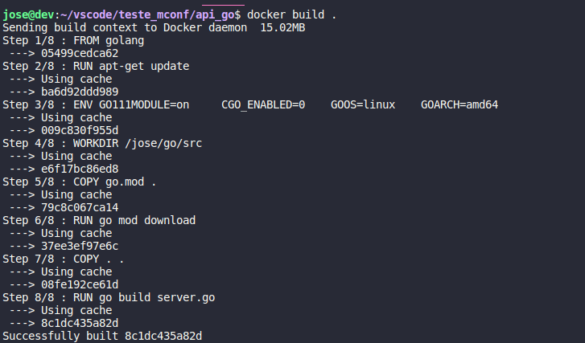

# Projeto MCONF

```cmd
localhost:3000
```


<br>

> Projeto constituí em contruir uma api em GO que consulta uma api externa e traz o resultado com uma leitura facilitada para humanos e rodar ela em um container no Docker.
<br>

> Antes vimos como ele esta sendo disposto em uma pagina web, agora veremos como esta no terminal do proprio vscode, pré-compilamento.

```go
go run server.go
```


<br>
<br>
## 💻 Pré-Requisitos
<br>
Antes de começar, verifique se você atendeu aos seguintes requisitos:

* Você instalou a versão mais recente de `Go`
* Você tem uma máquina `Linux/Windows/Mac`. 

## 🚀 Instalando <API em go>

Para instalar a <api>, siga estas etapas:
<br>
>Clone o repositório
<br>

Linux:
```
$ git clone https://github.com/JoseTorquato/mfconf-api_go.git
```
<br>
<br>

## Docker
<br>

> Com o terminal aberto na raiz do projeto ultilize os seguintes comandos.

```cmd
$ docker build .
```


```cmd
$ docker build -t mconf/api:joselucas-1 .
```


## ☕ Usando <api> com docker.

Para usar <api>, siga estas etapas:
<br>
```cmd
$ docker run -it --rm -p 3000 mconf/api:joselucas-1
```

```cmd
ls 
```
> Você verá os seguintes intens 
```
Dockerfile  README.md  api.html  go.mod  go.sum  image  server  server.go
```


Agora só executar o arquivo server com o comando.
```
chmod +x ./server 
```
Abra agora uma pagina web e digite.
```
localhost:3000
```

## O que ainda preciso implementar

- Buscar via linha de comando um nome especifico [] 
- Integração com script em Python [] 

## Contato

Linkedin: https://www.linkedin.com/in/josetorquato